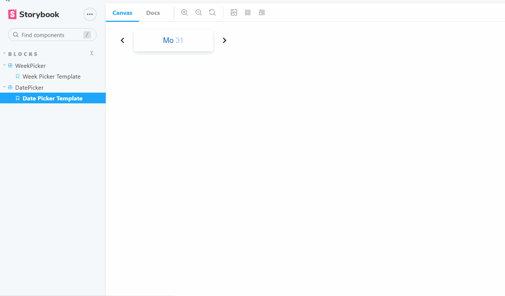

<h1 align="center">Date and Week Picker</h1>



## Description

The Calendar was created using technology: <a href="https://material-ui.com/">Material-Ui</a>, <a href="https://day.js.org/">Dayjs</a>, <a href="https://storybook.js.org/">Storybook</a>. It currently starts at 1.09 because it was created for students whose school year starts at 1.09, but you can change the date as you see fit (look for TODO). Also you can look week number from start of custom year. Enjoy it :)

## Where to begin:
- Clone the repository https://github.com/VladimirOlishevsky/custom-calendar.git
- Set ```yarn``` dependencies
- Start a ```yarn storybook``` project.
- Choose in storybook panel DatePicker or WeekPicker 

## Working with the project:

The ```DatePicker```:
- the background color of your current day is always tinted
- you can choose another day
- you can navigate between days and months using chevrons
- chevrons are disabled at the end of the calendar year (you can change this)
- Sunday is colored red
- a date not in the current month is displayed in gray

The ```WeekPicker```:
- current week always have border
- you can choose another week
- you can navigate between weeks using chevrons
- you can always look selected week in topside 
- when you press the "Today" button, the week will be selected as the current one.
